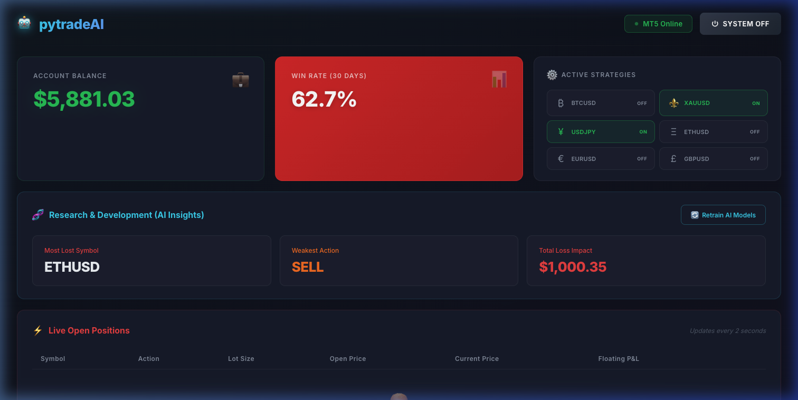

<div align="center">

# 🤖 pytradeAI

**ระบบเทรดอัตโนมัติที่ผสาน MetaTrader 5 + AI (Minimax / Gemini)**

<p>
  
  
  
  
  
</p>

</div>

---

## �️ Demo UI

<div align="center">



*แดชบอร์ดหลัก — แสดง M5 Trading Conditions พร้อม RSI, ADX, BB และ Sparkline ของ BTCUSD · XAUUSD · ETHUSD*

</div>

---

## �📖 ภาพรวม

pytradeAI คือแพลตฟอร์มเทรดอัตโนมัติที่รันบน FastAPI + WebSocket พร้อมแดชบอร์ดเว็บแบบ real-time ระบบรองรับทั้งโหมด **Live MT5** (เชื่อมต่อ MetaTrader 5 จริง) และ **Simulation** (ทดสอบโดยไม่ต้องติดตั้ง MT5) มีเครื่องมือวิเคราะห์ทางเทคนิค, AI signal, Backtesting, และ Telegram notifications ครบในที่เดียว

**Symbols ที่รองรับ:** BTCUSD · XAUUSD · ETHUSD (Exness Raw Spread)

---

## ✨ ฟีเจอร์หลัก

| หมวด                | ฟีเจอร์                                                                     |
| ------------------- | --------------------------------------------------------------------------- |
| **Auto-Trading**    | Strategy engine ทำงาน M5 loop วิเคราะห์ RSI + MA + BB + ADX ทุก 2 วินาที    |
| **AI Signal**       | ส่ง prompt ไปยัง Minimax / Gemini เพื่อวิเคราะห์ตลาดและเปิด order อัตโนมัติ |
| **Risk Management** | Daily loss limit · Consecutive loss pause · Spread check · Time filter      |
| **Dashboard**       | แดชบอร์ด real-time: ราคา, พอร์ต, P&L, สัญญาณ, Sparkline                     |
| **Backtesting**     | ทดสอบกลยุทธ์ย้อนหลังแบบ single symbol และ multi-symbol compare              |
| **Telegram**        | แจ้งเตือน open/close order และ risk alerts ผ่าน Telegram Bot                |
| **Simulation**      | จำลองราคา, order, history ได้โดยไม่ต้องมี MT5 terminal                      |

---

## 🏗️ สถาปัตยกรรม

```
┌─────────────────────────────────────────────────────────────┐
│                    Browser (Web UI)                         │
│   แดชบอร์ด · พอร์ต · ประวัติ · AI · Analytics · Backtest   │
│              static/index.html + app.js                     │
└──────────────────────────┬──────────────────────────────────┘
                           │  REST API + WebSocket
┌──────────────────────────┴──────────────────────────────────┐
│                  FastAPI Backend (server.py)                 │
│  ┌─────────────────┐  ┌──────────────────┐  ┌───────────┐  │
│  │ TradingEngine   │  │   AIEngine       │  │ Backtest  │  │
│  │ (M5 strategy    │  │ (Minimax/Gemini  │  │ Engine    │  │
│  │  RSI+MA+BB+ADX) │  │  auto-trade)     │  │           │  │
│  └────────┬────────┘  └────────┬─────────┘  └─────┬─────┘  │
│           │                   │                   │         │
│  ┌────────┴───────────────────┴───────────────────┘         │
│  │               MT5Connector                               │
│  │   Live MT5 terminal  /  Simulation mode                  │
│  └────────────────────────────────────────────────────────  │
│  ┌───────────────────────┐  ┌──────────────────────────┐    │
│  │  TelegramNotifier     │  │  SmartLogic / AIInsights  │    │
│  └───────────────────────┘  └──────────────────────────┘    │
└─────────────────────────────────────────────────────────────┘
```

### ไฟล์หลัก

| ไฟล์                   | หน้าที่                                            |
| ---------------------- | -------------------------------------------------- |
| `server.py`            | FastAPI app, REST API, WebSocket, lifespan         |
| `trading_engine.py`    | Strategy loop, signal calculation, risk management |
| `mt5_connector.py`     | MT5 connection, order execution, simulation        |
| `ai_engine.py`         | Minimax/Gemini API calls, auto-trade AI            |
| `ai_insights.py`       | วิเคราะห์ประวัติการเทรด สรุป AI insights           |
| `smart_logic.py`       | เข้า Trailing stop, partial close logic            |
| `backtest_engine.py`   | Backtesting สำหรับทดสอบกลยุทธ์ย้อนหลัง             |
| `telegram_notifier.py` | ส่งแจ้งเตือน Telegram                              |
| `static/index.html`    | หน้าเว็บ dashboard                                 |
| `static/app.js`        | JavaScript logic ทั้งหมด                           |
| `ai_settings.json`     | บันทึก AI settings (API keys, lot size, SL/TP)     |
| `mt5_accounts.json`    | บันทึก MT5 accounts (local only)                   |

---

## 📐 Symbols & Trading Parameters

### Broker: Exness (Raw Spread Account)

| Feature              | BTCUSD ₿         | XAUUSD ⚜️        | ETHUSD Ξ         |
| -------------------- | ---------------- | ---------------- | ---------------- |
| Contract Size        | 1 BTC            | 100 oz           | 1 ETH            |
| Pip Size             | 0.1              | 0.01             | 0.1              |
| Min Volume           | 0.01 lot         | 0.01 lot         | 0.1 lot          |
| Max Volume           | 200 lots         | 200 lots         | 2000 lots        |
| Commission           | $2.0/lot/side    | $3.5/lot/side    | $0.5/lot/side    |
| Swap                 | Triple Fri       | Triple Wed       | Triple Fri       |
| **Default Lot**      | 0.01             | 0.01             | 0.1              |
| **SL (dollar-pips)** | 200 (~$2.00)     | 200 (~$2.00)     | 100 (~$1.00)     |
| **TP (dollar-pips)** | 200 (~$1.96 net) | 200 (~$1.93 net) | 200 (~$1.98 net) |

> **Dollar-pip:** 1 pip = $0.01 — ใช้คำนวณ SL/TP โดยไม่ขึ้นกับราคาตลาด

---

## 📊 กลยุทธ์การเทรด (Indicator Spec)

### Indicator Parameters

| Symbol | MA Fast | MA Slow | BB       | RSI Oversold              | RSI Overbought            |
| ------ | ------- | ------- | -------- | ------------------------- | ------------------------- |
| BTCUSD | MA21    | MA55    | 20, 2.0σ | ≤25 (strong) / ≤35 (weak) | ≥72 (strong) / ≥62 (weak) |
| ETHUSD | MA21    | MA55    | 20, 2.0σ | ≤25 (strong) / ≤35 (weak) | ≥72 (strong) / ≥62 (weak) |
| XAUUSD | MA10    | MA30    | 20, 2.2σ | ≤30 (strong) / ≤38 (weak) | ≥65 (strong) / ≥58 (weak) |

### Scoring System (max 7 คะแนน)

| ปัจจัย                       | BUY                               | SELL                              | คะแนน |
| ---------------------------- | --------------------------------- | --------------------------------- | ----- |
| RSI oversold/overbought แรง  | ≤ threshold_strong                | ≥ threshold_strong                | +2    |
| RSI oversold/overbought อ่อน | ≤ threshold_weak                  | ≥ threshold_weak                  | +1    |
| MA trend                     | MA_fast > MA_slow                 | MA_fast < MA_slow                 | +1    |
| Bollinger Band + trend       | price ≤ Lower BB + uptrend        | price ≥ Upper BB + downtrend      | +2    |
| 2-bar confirmation           | close[-1] > close[-2] > close[-3] | close[-1] < close[-2] < close[-3] | +1    |
| Momentum penalty             | 4/4 bars bearish                  | 4/4 bars bullish                  | -1    |

### เงื่อนไขเปิด Order

```
BUY  → buy_score ≥ 4  AND  sell_score ≤ 1  AND  MA_fast > MA_slow  AND  ADX(14) ≥ 20
SELL → sell_score ≥ 4  AND  buy_score ≤ 1  AND  MA_fast < MA_slow  AND  ADX(14) ≥ 20
```

> ADX(14) < 20 = ตลาด sideways → ไม่เปิด order

---

## 🛡️ Risk Management

| กฎ                            | ค่า                                                     |
| ----------------------------- | ------------------------------------------------------- |
| Daily loss limit              | $3.00 (หยุดเทรดทุก symbol เมื่อ P&L วันนี้ ≤ -$3)       |
| Consecutive losses → cooldown | 2 ครั้ง → pause 15 นาที                                 |
| Consecutive losses → stop     | 3 ครั้ง → หยุดทั้งวัน (reset ตอนเที่ยงคืน)              |
| Max trades/symbol/day         | 2 order                                                 |
| Cooldown หลัง trade           | 5 นาที                                                  |
| Spread check                  | ไม่เปิด ถ้า spread > 1.5× rolling average (50 readings) |
| Position limit                | 1 position ต่อ symbol                                   |

### เวลาเทรด (UTC)

| Symbol | ช่วงเวลา UTC                | GMT+7                           |
| ------ | --------------------------- | ------------------------------- |
| XAUUSD | 07:00–15:00 (จันทร์–ศุกร์)  | 14:00–22:00 (London+NY overlap) |
| BTCUSD | 02:00–09:00 และ 13:00–19:00 | 09:00–16:00 และ 20:00–02:00     |
| ETHUSD | 02:00–09:00 และ 13:00–19:00 | 09:00–16:00 และ 20:00–02:00     |

---

## 🤖 AI Engine

ระบบรองรับ 2 providers:

| Provider    | Model            | หมายเหตุ              |
| ----------- | ---------------- | --------------------- |
| **Minimax** | MiniMax-Text-01  | Default               |
| **Gemini**  | gemini-1.5-flash | ต้องมี Google API Key |

**การทำงาน:**

1. ดึงราคาปัจจุบัน + ประวัติ 50 แท่ง M5
2. ส่ง prompt พร้อม technical indicators ไปยัง AI
3. AI ตอบกลับ: `{"signal": "BUY"|"SELL"|"HOLD", "confidence": 0-100, "reasoning": "..."}`
4. ถ้า `auto_trade = true` และ confidence ≥ threshold → ส่ง order เข้า MT5

**AI Insights** จะวิเคราะห์ประวัติการเทรดและแนะนำการปรับกลยุทธ์อัตโนมัติ

---

## 🔔 Telegram Notifications

ตั้งค่าได้ในหน้า **เทรดออโต้ AI** → Telegram Settings

| การแจ้งเตือน | ทริกเกอร์                                |
| ------------ | ---------------------------------------- |
| Order Open   | เมื่อเปิด position ใหม่                  |
| Order Close  | เมื่อ TP/SL หรือปิด manual               |
| Risk Alert   | Daily loss limit, consecutive loss pause |
| Strategy     | เมื่อ strategy signal เกิดขึ้น           |

---

## 🚀 การติดตั้งและรันระบบ

### Requirements

- Python 3.9+
- MetaTrader 5 terminal (optional — ระบบมี simulation mode)
- Exness account (หรือ broker อื่นที่รองรับ MT5)

### ติดตั้ง

```bash
# 1. Clone repository
git clone https://github.com/yourname/pytradeAI.git
cd pytradeAI

# 2. สร้าง virtual environment
python -m venv .venv

# Windows
.venv\Scripts\activate

# macOS/Linux
source .venv/bin/activate

# 3. ติดตั้ง dependencies
pip install -r requirements.txt

# (ถ้าต้องการ MetaTrader5 จริง — Windows only)
pip install MetaTrader5
```

### รันเซิร์ฟเวอร์

```bash
python server.py
```

เปิด browser ไปที่: **http://localhost:8000**

> ถ้าไม่มี MT5 ติดตั้ง ระบบจะรันใน **Simulation Mode** โดยอัตโนมัติ

### Dependencies (`requirements.txt`)

```
fastapi==0.115.0
uvicorn[standard]==0.30.0
websockets==12.0
pandas==2.2.0
numpy==1.26.0
```

---

## 🖥️ การใช้งานแดชบอร์ด

### เมนูหลัก

| เมนู                | คำอธิบาย                                         |
| ------------------- | ------------------------------------------------ |
| 📊 **แดชบอร์ด**     | ภาพรวม: P&L, สถิติวันนี้, สัญญาณ, Sparkline      |
| 📋 **พอร์ตเปิด**    | รายการ positions ที่เปิดอยู่ พร้อม P&L real-time |
| 🗂️ **ประวัติเทรด**  | ประวัติ order ทั้งหมด กรอง/เรียงได้              |
| 🧠 **วิเคราะห์ AI** | AI insights, ดู AI thinking log                  |
| 📊 **Analytics**    | กราฟ performance, win rate, equity curve         |
| 🧪 **Backtesting**  | ทดสอบกลยุทธ์ย้อนหลัง (หน้าแยก)                   |
| 🤖 **เทรดออโต้ AI** | ตั้งค่า AI provider, สัญญาณ, Telegram            |
| 📜 **บันทึกระบบ**   | System log แบบ real-time กรองตาม category        |

### การเชื่อมต่อ MT5

1. คลิกปุ่ม 🔌 มุมบนขวา
2. กรอก Login, Password, Server
3. คลิก **Connect**
4. สามารถ **บันทึกบัญชี** และตั้ง auto-connect ได้

### เปิด/ปิดระบบ

- ปุ่ม **OFF/ON** มุมบนขวา = เปิด/ปิด strategy engine ทั้งหมด
- แต่ละ symbol สามารถ toggle แยกได้ในหน้า Dashboard

---

## 🧪 Backtesting

เข้าถึงผ่านเมนู **Backtesting** หรือ `/static/backtest.html`

**Single Symbol Backtest:**

- เลือก symbol (BTCUSD / XAUUSD / ETHUSD)
- กำหนดจำนวนวัน และ Starting Balance
- ดู: Win Rate, Total P&L, Max Drawdown, Trade List

**Multi-Symbol Compare:**

- ใส่ symbols คั่นด้วย comma: `BTCUSD,XAUUSD,ETHUSD`
- เปรียบเทียบ performance แบบ side-by-side

---

## 🔌 REST API Reference

### System

| Method | Endpoint             | คำอธิบาย                |
| ------ | -------------------- | ----------------------- |
| GET    | `/api/status`        | สถานะระบบทั้งหมด        |
| POST   | `/api/system/toggle` | เปิด/ปิด trading system |
| GET    | `/api/log`           | ดึง system log          |
| DELETE | `/api/log`           | ลบประวัติ log ทั้งหมด   |

### MT5

| Method | Endpoint              | คำอธิบาย               |
| ------ | --------------------- | ---------------------- |
| POST   | `/api/mt5/connect`    | เชื่อมต่อ MT5          |
| POST   | `/api/mt5/disconnect` | ตัดการเชื่อมต่อ        |
| GET    | `/api/account`        | ข้อมูลบัญชี            |
| GET    | `/api/positions`      | พอร์ตเปิดปัจจุบัน      |
| GET    | `/api/history`        | ประวัติเทรด            |
| GET    | `/api/prices`         | ราคาปัจจุบันทุก symbol |

### Trading

| Method | Endpoint                           | คำอธิบาย                       |
| ------ | ---------------------------------- | ------------------------------ |
| POST   | `/api/trade/place`                 | เปิด order                     |
| POST   | `/api/trade/close/{ticket}`        | ปิด position                   |
| GET    | `/api/trading/conditions`          | สัญญาณ + indicators ทุก symbol |
| GET    | `/api/trading/conditions/{symbol}` | สัญญาณของ symbol นั้น          |
| POST   | `/api/strategy/{symbol}/toggle`    | toggle strategy                |

### AI

| Method | Endpoint                   | คำอธิบาย               |
| ------ | -------------------------- | ---------------------- |
| POST   | `/api/ai/analyze/{symbol}` | ขอ AI วิเคราะห์ symbol |
| GET    | `/api/ai/settings`         | ดู AI settings         |
| POST   | `/api/ai/settings`         | อัปเดต AI settings     |
| GET    | `/api/ai/status`           | สถานะ AI engine        |

### Backtest

| Method | Endpoint                | คำอธิบาย               |
| ------ | ----------------------- | ---------------------- |
| POST   | `/api/backtest/run`     | รัน backtest           |
| GET    | `/api/backtest/compare` | เปรียบเทียบหลาย symbol |

### WebSocket

```
ws://localhost:8000/ws
```

รับ messages: `status`, `prices`, `positions`, `history`, `log`, `ai_thinking`

---

## 📁 โครงสร้างโปรเจค

```
pytradeAI/
├── server.py              # FastAPI app หลัก
├── trading_engine.py      # Strategy engine + risk management
├── mt5_connector.py       # MT5 connection + simulation
├── ai_engine.py           # Minimax / Gemini integration
├── ai_insights.py         # AI trade analysis
├── smart_logic.py         # Trailing stop / partial close
├── backtest_engine.py     # Backtesting
├── telegram_notifier.py   # Telegram Bot
├── ai_settings.json       # AI settings (บันทึกอัตโนมัติ)
├── mt5_accounts.json      # Saved MT5 accounts (local only)
├── requirements.txt
├── README.md
└── static/
    ├── index.html         # Dashboard
    ├── backtest.html      # Backtesting page
    ├── app.js             # Frontend JavaScript
    └── styles.css         # Stylesheet
```

---

## ⚠️ ข้อควรระวัง

- **ETHUSD**: ไม่สามารถปิด partial ได้ถ้าน้อยกว่า 0.1 lot — ระบบใช้ 0.1 เป็น minimum เสมอ
- **api_keys**: เก็บใน `ai_settings.json` บนเครื่อง ไม่ส่งออก Cloud
- **MT5 passwords**: เก็บใน `mt5_accounts.json` บนเครื่อง ไม่ควร commit ไฟล์นี้
- **Simulation mode**: ราคาจำลองด้วย random walk — backtest/simulation ไม่เท่า live
- **ADX close-only**: ADX ที่คำนวณใช้ close price แทน OHLC เพราะ history buffer เก็บแค่ close — ค่าอาจต่างจาก MT5 indicator เล็กน้อย

---

<div align="center">
<sub>pytradeAI — Built with FastAPI · Exness MT5 · Minimax/Gemini AI</sub>
</div>
